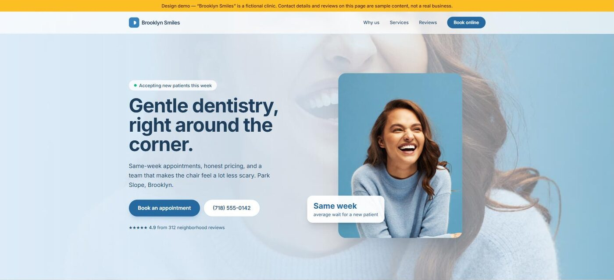

# A cold-outreach lead-gen pipeline, start to finish — including everything that went wrong

This repository is a complete, honest record of one real run of an AI-assisted
lead generation pipeline: build a demo website with AI-generated media, use a
B2B data platform to find local businesses whose own websites have problems,
verify those problems by hand, and write cold emails that lead with the problem
rather than the pitch.

It was run on 30 July 2026 against dental practices in Austin, Texas, following
the workflow demonstrated in [this video by Samin
Yasar](https://www.youtube.com/watch?v=1ofs469cmDE). Everything was built by
Claude Code (Fable 5 / Opus 5) driving the tools listed below.

**The headline result is the failure rate, not the success rate.** The automated
scanner produced 20 prospects. After checking every claim by hand, **2 survived**
and 18 were artifacts of my own tooling — my scanner being wrong about other
people's businesses. If you take one thing from this repo, take
[`pipeline/VERIFICATION.md`](pipeline/VERIFICATION.md).

**Nothing was ever sent.** The two emails are drafts. No mailbox, no sending
domain, no campaign was configured at any point.

---

## The demo site, live

This is the sales asset — the thing the cold email links to. One HTML file, no
build step, with a hero video and three photographs that were generated by AI in
about four minutes. **Click the image to open it.**

[](https://az9713.github.io/ai-lead-gen-teardown/dental-demo/)

- **GitHub Pages** — https://az9713.github.io/ai-lead-gen-teardown/dental-demo/
- **Vercel**, the URL that appears in the drafts — https://dental-demo-chi-rust.vercel.app

Both serve the same file. The amber banner across the top is deliberate and
non-negotiable — see [the last section](#two-things-worth-knowing-before-you-copy-this).

## Start here

| If you want… | Read |
|---|---|
| The whole story, written for someone new to lead gen | **[`JOURNEY.md`](JOURNEY.md)** |
| The finished deliverable — the two cold emails | [`pipeline/draft-emails.md`](pipeline/draft-emails.md) |
| The most useful file here — why 18 of 20 leads were fake | [`pipeline/VERIFICATION.md`](pipeline/VERIFICATION.md) |
| The scanner, with a comment on every guard and why it exists | [`pipeline/audit.py`](pipeline/audit.py) |
| The demo website that acts as the sales asset | [`dental-demo/index.html`](dental-demo/index.html) — live at **https://az9713.github.io/ai-lead-gen-teardown/dental-demo/** |

## The two draft emails

These are the deliverable, reproduced in full. Both are **drafts — neither was
sent**, and no sending was ever configured. Practice and person names are
replaced by the synthetic labels described under [Redaction](#redaction); every
measurement is real and was reproduced by hand before it went in.

The shape to notice: the problem comes first, stated specifically enough that only
someone who actually looked could have written it, followed by why it matters and
how to fix it *for free*. The pitch is one sentence, in the last paragraph.

### 1 — Practice A, Austin TX · ready to send

- **To:** `contact.golf@practice-a.example` — Contact Golf, General Dentist
- **Source:** Clay people search → Clay "Work Email" enrichment routine
- **Signal:** verified in Chrome and by DNS lookup on 2026-07-30

> **Subject:** practice-a.example (without the www) doesn't load — quick heads up
>
> Hi Dr. Golf,
>
> I was looking at Austin dental practices this week and hit something on your site
> worth flagging, whether or not we ever speak.
>
> `www.practice-a.example` works fine. But the bare `practice-a.example` — no www —
> doesn't load at all. It currently points at 192.0.2.1, which is a reserved address
> that can't host a website, so the request just hangs until the browser gives up.
> I checked in Chrome and it never resolves.
>
> That matters because most people type a domain without the www, and plenty of
> directory listings and printed materials drop it too. Anyone who does that right
> now sees a blank error page.
>
> It's usually a five-minute DNS fix — one A record or a redirect from the bare
> domain to the www version. Happy to send your host the exact details, no strings.
>
> If a refresh is on the table anyway, I build fast dental sites with online booking
> and can share a live demo: https://dental-demo-chi-rust.vercel.app. Either way, I'd
> fix the DNS first.
>
> — [YOUR NAME]
> [YOUR EMAIL]

*Why this one is real:* `nslookup` returns `192.0.2.1` — TEST-NET-1, reserved by
RFC 5737 for documentation, so it can never serve traffic. Chrome failed to
navigate to it; the tab stayed on the previous page. The `www` form returns a
normal, working site.

### 2 — Practice B, Austin TX · needs a recipient first

- **To:** nobody yet — Clay's people search returned no one at
  `practice-b.example`, so a name has to come off their staff page or LinkedIn
  before this can go out
- **Signal:** verified by serial timing, three consecutive runs

> **Subject:** practice-b.example is taking 4–8 seconds to load
>
> Hi [NAME],
>
> Quick note from looking at Austin endodontic practices: practice-b.example is slow
> to respond. I timed it three times from a normal connection and got 4.5s, 6.6s and
> 8.0s before the first byte of the page arrived — the delay is server-side, not
> images or connection setup.
>
> For context, Google treats anything past ~2.5s as a poor experience, and referring
> dentists checking you out on a phone are the ones most likely to bounce.
>
> That pattern usually points at slow hosting or an unoptimised CMS rather than
> anything you did. Worth asking your host about, and it's often fixable without a
> rebuild.
>
> If you'd rather start fresh, I build fast dental sites with online booking —
> here's a live demo: https://dental-demo-chi-rust.vercel.app. Would a 15-minute
> call be useful?
>
> — [YOUR NAME]
> [YOUR EMAIL]

*Why this one is real:* three serial requests — no concurrency, so no chance of
rate-limiting myself — gave time-to-first-byte of 4.40s, 6.47s and 7.83s. Connect
time stayed under 0.36s throughout, which is what proves the delay is the server
generating the page rather than the network.

### And the ones that didn't make it

[`pipeline/draft-emails.md`](pipeline/draft-emails.md) ends with a section called
**"Not sent, and why"**, naming every prospect that was dropped. The short version:
one practice topped the rankings on a signal that turned out to be a stale domain
in the data platform rather than a dead business; four more were flagged as broken
but load perfectly in a real browser; and about fifteen were flagged only for a
stale copyright year, which is not a business problem and not worth an email.

## What's in here

```
dental-demo/          The sales asset: a single-file demo dental clinic site
  index.html            Tailwind via CDN, Inter, no build step, one file
  assets/               AI-generated: a 5s looping video + 3 stills (179 KB total)
  vercel.json           The entire deploy config

pipeline/             The lead-gen run, anonymised (see "Redaction" below)
  prospects_raw.json    What the B2B search returned: 37 practices
  audit.py              The site scanner that turns domains into signals
  audit_results.json    Its raw output over 35 unique domains
  prospects.csv         The scored, human-readable prospect list
  people_raw.json       Decision-makers found at the qualified practices
  routines.json         The enrichment routines available in the workspace
  email_in*.jsonl       Work-email enrichment requests
  email_results*.jsonl  …and what came back (2 hits from 9 people)
  VERIFICATION.md       Every signal checked by hand, and the 6 ways it lied
  draft-emails.md       The deliverable: 2 drafts, plus "not sent, and why"

redact.py             Generates pipeline/ from the private originals
JOURNEY.md            The full write-up: every phase, every wrong turn
index.html            Redirect, so the Pages root lands on the demo site
preview.jpg           Screenshot of the live page, for this README
```

## The tools, and what each one actually did

- **Claude Code (Fable 5 / Opus 5)** — the agent that ran everything. Wrote the
  site, wrote the scanner, drove the other tools, and did the verification.
- **[Higgsfield](https://higgsfield.ai)** — AI image and video generation. Made
  the hero video and three photographs for the demo site. Cost: 7.5 credits for
  the 5-second video, on a 102-credit starter plan.
- **[Clay](https://www.clay.com)** — B2B data. Supplied the company list, the
  people at those companies, and the verified work emails. Free tier: 50 results
  per search, 100 searches per month.
- **Vercel** — hosting for the demo site, so the cold email can contain a link a
  stranger can open.
- **Chrome (via the Claude in Chrome extension)** — the verification layer. This
  turned out to be the single most important tool in the stack, because it is
  the only one that sees what a customer sees.
- **WSL Ubuntu** — because Clay ships no Windows binary. See `JOURNEY.md`.

## Redaction

The pipeline was run against **real dental practices and real named people**.
Publishing that would mean putting scraped contact data and unflattering
judgments about identifiable small businesses on the open web, so:

- Every practice appears as `Practice A`…`Practice AK` on a `practice-*.example`
  domain. `.example` is reserved by RFC 2606 and can never resolve to anyone.
- Every person appears as `Contact Alpha`, `Contact Bravo`, and so on.
- Aliases are deliberately synthetic rather than realistic-sounding, because a
  plausible fake name can collide with a real business somewhere.
- Marketing descriptions, LinkedIn URLs, platform record IDs and workspace-scoped
  routine IDs are stripped.

`redact.py` does this and then **fails loudly** if any of the 127 real
identifiers survives anywhere in `pipeline/`. The unredacted originals stay on
the machine that produced them and are excluded by `.gitignore`, as is
`redaction-keys.json` — the alias mapping is itself an identifier, so it is not
published either. Without that file the script still runs and still anonymises
everything; only which practice gets which letter changes.

One thing redaction does not hide: the run targeted dentists in Austin, Texas,
and the measurements are real. Someone determined enough could re-run a similar
search and guess at the mapping. The city is kept because it is already public —
it is the demo city from the source video — and because the method is
uninterpretable without it.

## Reproducing this

```bash
python redact.py            # regenerate pipeline/ from the originals + self-check
cd dental-demo && python -m http.server 8899    # preview the demo site
cd dental-demo && vercel deploy --prod --yes    # redeploy it
```

`pipeline/audit.py` expects a `prospects_raw.json` next to it in the same shape
Clay returns, and needs `curl` on the PATH. Nothing else has dependencies.

## Two things worth knowing before you copy this

**The demo site carries a banner saying the clinic is fictional, and it stays.**
"Brooklyn Smiles" has an invented phone number, address and testimonials. On a
public URL that a prospect opens from a cold email, without the banner it reads
as a client you are claiming. With it, it reads as a work sample. Keep it.

**Do not put an unverified signal in an outreach email.** This is the whole
lesson of this repository. An automated scan telling a business owner their site
is broken, when it works fine and your scraper was simply being blocked, is
worse than not emailing at all.
